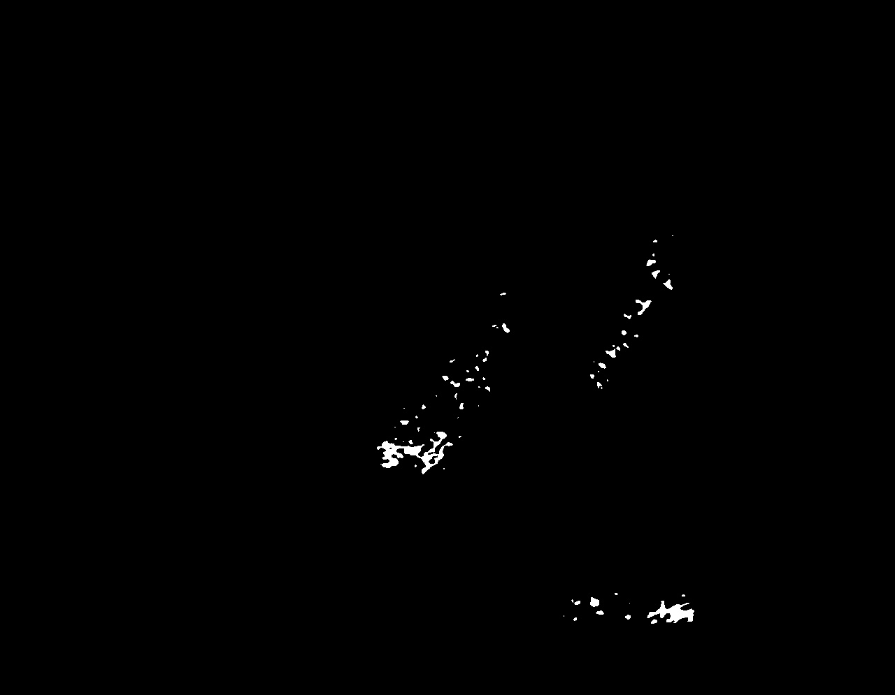

# NeoPolyp
# Version 1.0
Image segmentation project, using BKAI-IGH NeoPolyp dataset

## 11/12/2025
I've done my first version. However there are some problems :
- I didn't made the correct mask with ClassId = 0 means neoplastic polyp, while ClassId = 1 means non-neoplastic polyp.
- Because of the above problem, I can't create the result for the first submition.
- The result of model still bad anyway.

